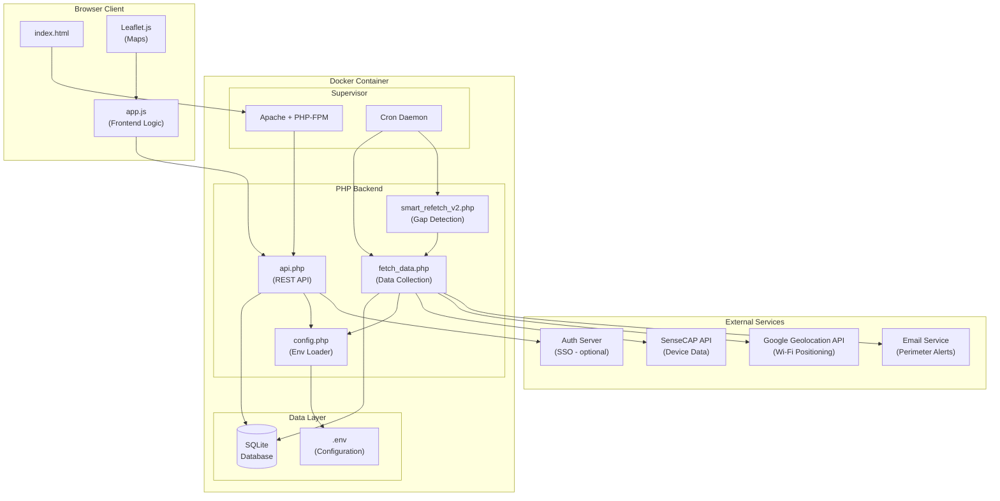
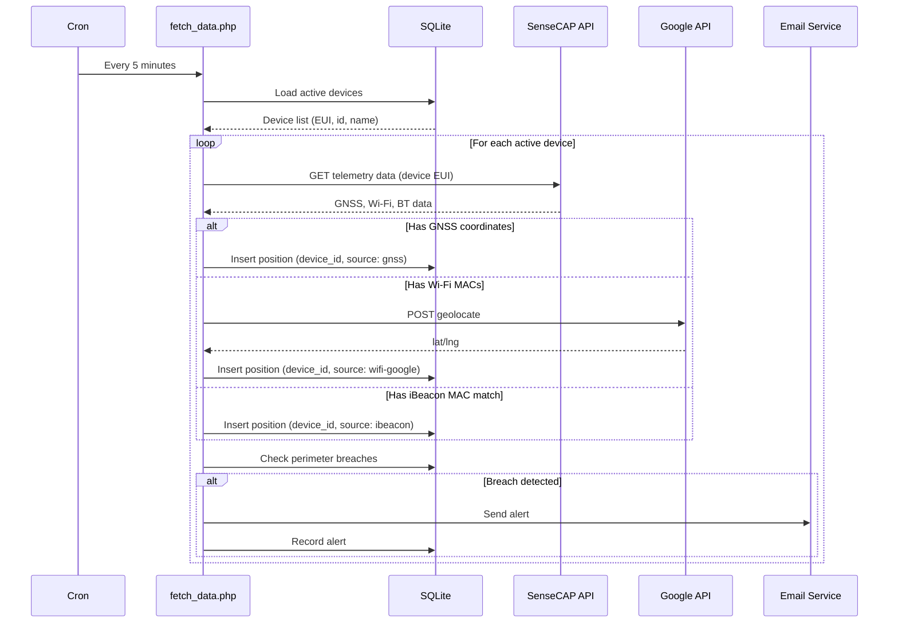
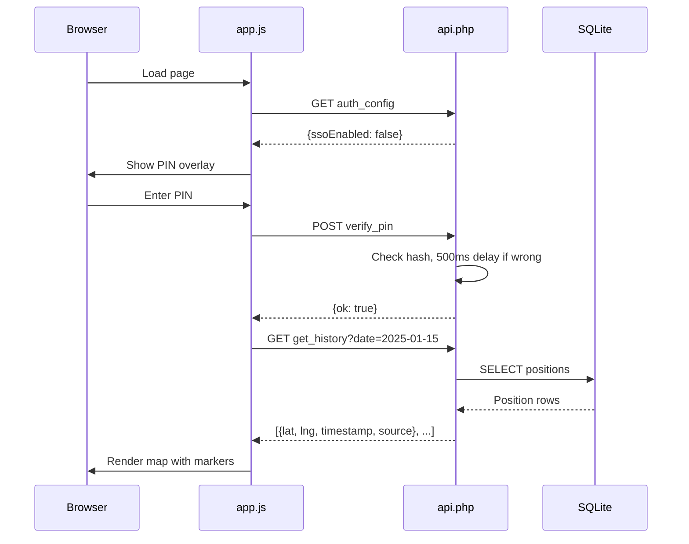
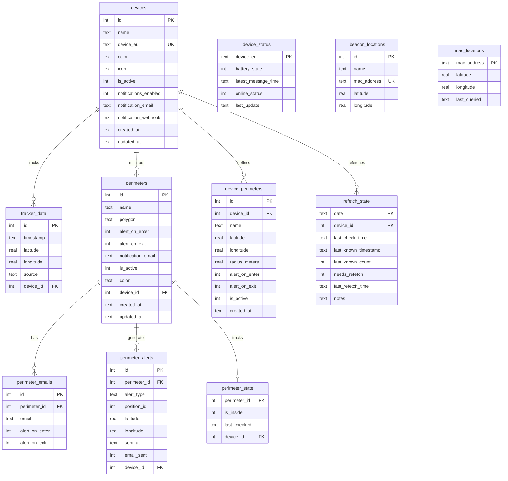
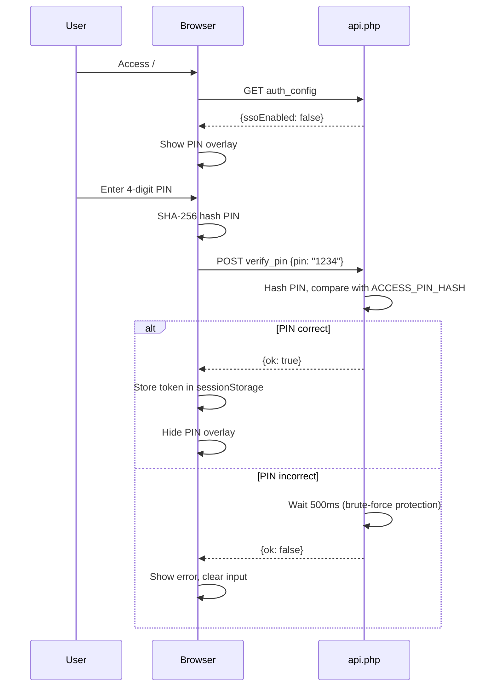
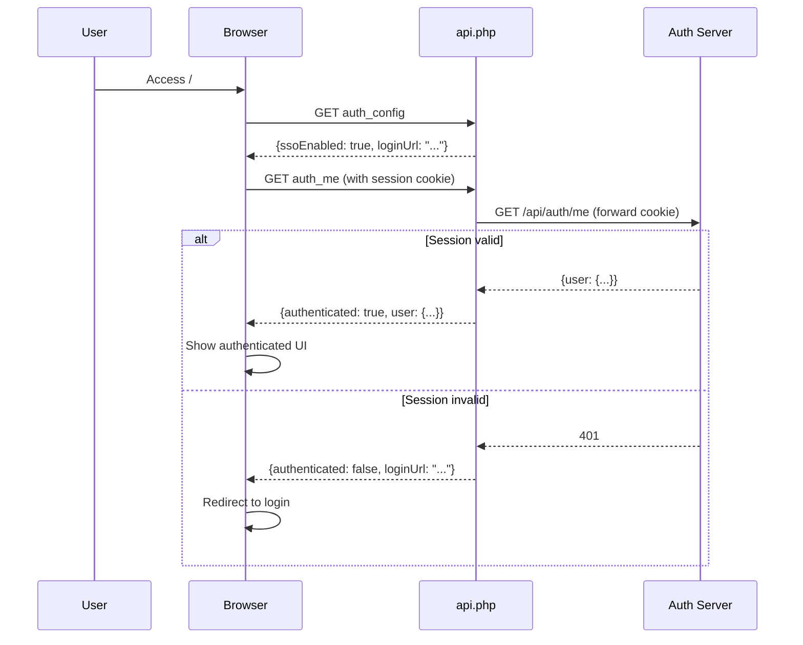

# Architecture

This document describes the system architecture, component interactions, database schema, and authentication flow for the Family Tracker application.

## Table of Contents

- [System Architecture](#system-architecture)
- [Component Overview](#component-overview)
- [Data Flow](#data-flow)
- [Database Schema](#database-schema)
- [External APIs and Services](#external-apis-and-services)
- [Authentication Flow](#authentication-flow)
- [Cron Jobs and Background Processing](#cron-jobs-and-background-processing)
- [Perimeter Detection Algorithm](#perimeter-detection-algorithm)

## System Architecture



## Component Overview

### Frontend Components

| Component | File | Purpose |
|-----------|------|---------|
| HTML Shell | `index.html` | Main page structure, overlays, forms |
| Frontend Logic | `app.js` | Authentication, map, API calls, UI handlers |
| Styling | `style.css` | Dark/light themes, responsive design |
| Maps | Leaflet.js | Map rendering and interaction |
| Drawing | Leaflet.draw | Polygon drawing for perimeters |

### Backend Components

| Component | File | Purpose |
|-----------|------|---------|
| REST API | `api.php` | All HTTP endpoints (30+ actions) |
| Data Fetcher | `fetch_data.php` | Cron job for SenseCAP data |
| Smart Refetch | `smart_refetch_v2.php` | Gap detection and repair |
| Config Loader | `config.php` | Environment variable management |

### Infrastructure Components

| Component | File | Purpose |
|-----------|------|---------|
| Process Manager | `supervisord.conf` | Runs Apache + cron |
| Container Init | `entrypoint.sh` | Database init, env setup |
| Web Server | `apache-vhost.conf` | Apache configuration |
| Scheduler | `crontab` | Scheduled job definitions |
| Security | `.htaccess` | File access restrictions |

## Data Flow

### Position Data Collection (Multi-Device)



### Frontend Request Flow



## Database Schema

### Entity Relationship Diagram



### Table Descriptions

#### `devices`
Registry of tracked devices. Each device has its own EUI, color, and settings.

| Column | Type | Description |
|--------|------|-------------|
| `id` | INTEGER | Auto-increment primary key |
| `name` | TEXT | Human-readable device name |
| `device_eui` | TEXT | SenseCAP Device EUI (unique) |
| `color` | TEXT | Display color on map (hex) |
| `icon` | TEXT | Icon type (default: "default") |
| `is_active` | INTEGER | Device enabled for tracking (0/1) |
| `notifications_enabled` | INTEGER | Enable notifications (0/1) |
| `notification_email` | TEXT | Email for device notifications |
| `notification_webhook` | TEXT | Webhook URL for notifications |
| `created_at` | TEXT | Creation timestamp |
| `updated_at` | TEXT | Last modification timestamp |

#### `tracker_data`
Stores all position records from tracking devices.

| Column | Type | Description |
|--------|------|-------------|
| `id` | INTEGER | Auto-increment primary key |
| `timestamp` | TEXT | UTC timestamp (YYYY-MM-DD HH:MM:SS) |
| `latitude` | REAL | Latitude coordinate |
| `longitude` | REAL | Longitude coordinate |
| `source` | TEXT | Position source: `gnss`, `wifi-google`, `wifi-cache`, `ibeacon` |
| `device_id` | INTEGER | Foreign key to devices (default: 1) |

#### `device_status`
Caches device status information from SenseCAP API.

| Column | Type | Description |
|--------|------|-------------|
| `device_eui` | TEXT | Device EUI (primary key) |
| `battery_state` | INTEGER | 0=low, 1=good, NULL=unknown |
| `latest_message_time` | TEXT | Last data upload time |
| `online_status` | INTEGER | 0=offline, 1=online |
| `last_update` | TEXT | When this record was updated |

#### `ibeacon_locations`
Static location markers for known iBeacon devices.

| Column | Type | Description |
|--------|------|-------------|
| `id` | INTEGER | Auto-increment primary key |
| `name` | TEXT | Human-readable beacon name |
| `mac_address` | TEXT | Beacon MAC address (unique) |
| `latitude` | REAL | Fixed latitude |
| `longitude` | REAL | Fixed longitude |

#### `mac_locations`
Cache for Wi-Fi AP geolocation results (positive and negative).

| Column | Type | Description |
|--------|------|-------------|
| `mac_address` | TEXT | Wi-Fi AP MAC (primary key) |
| `latitude` | REAL | Cached latitude (NULL = failed lookup) |
| `longitude` | REAL | Cached longitude (NULL = failed lookup) |
| `last_queried` | TEXT | When lookup was performed |

#### `perimeters`
Geographic zone definitions with alert configuration.

| Column | Type | Description |
|--------|------|-------------|
| `id` | INTEGER | Auto-increment primary key |
| `name` | TEXT | Zone name (e.g., "Home", "School") |
| `polygon` | TEXT | JSON array of {lat, lng} points |
| `alert_on_enter` | INTEGER | Send alerts on entry (0/1) |
| `alert_on_exit` | INTEGER | Send alerts on exit (0/1) |
| `notification_email` | TEXT | Legacy: single email (deprecated) |
| `is_active` | INTEGER | Zone enabled (0/1) |
| `color` | TEXT | Display color (hex) |
| `device_id` | INTEGER | Foreign key to devices (optional) |
| `created_at` | TEXT | Creation timestamp |
| `updated_at` | TEXT | Last modification timestamp |

#### `perimeter_emails`
Multiple email recipients per perimeter with individual alert preferences.

| Column | Type | Description |
|--------|------|-------------|
| `id` | INTEGER | Auto-increment primary key |
| `perimeter_id` | INTEGER | Foreign key to perimeters |
| `email` | TEXT | Email address |
| `alert_on_enter` | INTEGER | Receive entry alerts (0/1) |
| `alert_on_exit` | INTEGER | Receive exit alerts (0/1) |

#### `perimeter_alerts`
History of all perimeter breach alerts.

| Column | Type | Description |
|--------|------|-------------|
| `id` | INTEGER | Auto-increment primary key |
| `perimeter_id` | INTEGER | Foreign key to perimeters |
| `alert_type` | TEXT | `entered` or `exited` |
| `latitude` | REAL | Position at breach |
| `longitude` | REAL | Position at breach |
| `sent_at` | TEXT | Alert timestamp |
| `email_sent` | INTEGER | Email successfully sent (0/1) |
| `device_id` | INTEGER | Foreign key to devices (optional) |

#### `perimeter_state`
Tracks current inside/outside state for each perimeter.

| Column | Type | Description |
|--------|------|-------------|
| `perimeter_id` | INTEGER | Foreign key to perimeters |
| `is_inside` | INTEGER | Currently inside (0/1) |
| `last_checked` | TEXT | Last check timestamp |
| `device_id` | INTEGER | Foreign key to devices (optional) |

#### `device_perimeters`
Circular geofence zones assigned to specific devices.

| Column | Type | Description |
|--------|------|-------------|
| `id` | INTEGER | Auto-increment primary key |
| `device_id` | INTEGER | Foreign key to devices |
| `name` | TEXT | Zone name (e.g., "Home", "School") |
| `latitude` | REAL | Center latitude |
| `longitude` | REAL | Center longitude |
| `radius_meters` | REAL | Radius in meters (default: 500) |
| `alert_on_enter` | INTEGER | Send alert on entry (0/1) |
| `alert_on_exit` | INTEGER | Send alert on exit (0/1) |
| `is_active` | INTEGER | Zone enabled (0/1) |
| `created_at` | TEXT | Creation timestamp |

#### `refetch_state`
Tracks smart refetch status for detecting data gaps (per device).

| Column | Type | Description |
|--------|------|-------------|
| `date` | TEXT | Date (YYYY-MM-DD, composite PK) |
| `device_id` | INTEGER | Foreign key to devices (composite PK) |
| `last_check_time` | TEXT | When last analyzed |
| `last_known_timestamp` | TEXT | Last position timestamp for date |
| `last_known_count` | INTEGER | Position count when last checked |
| `needs_refetch` | INTEGER | Flagged for refetch (0/1) |
| `last_refetch_time` | TEXT | When last refetched |
| `notes` | TEXT | Issue description |

## External APIs and Services

### SenseCAP API

**Base URL:** `https://sensecap.seeed.cc/openapi/`

**Authentication:** HTTP Basic Auth (Access ID : Access Key)

**Endpoints Used:**

| Endpoint | Method | Purpose |
|----------|--------|---------|
| `/list_telemetry_data` | GET | Fetch GNSS, Wi-Fi, BT data |
| `/view_device_running_status` | POST | Get battery and online status |

**Measurement IDs:**

| ID | Data Type |
|----|-----------|
| 4197 | GNSS Longitude |
| 4198 | GNSS Latitude |
| 5001 | Wi-Fi MAC addresses |
| 5002 | BT iBeacon MAC addresses |
| 5003 | Battery status |

### Google Geolocation API

**URL:** `https://www.googleapis.com/geolocation/v1/geolocate?key=<API_KEY>`

**Method:** POST

**Request:**
```json
{
  "considerIp": false,
  "wifiAccessPoints": [
    {"macAddress": "AA:BB:CC:DD:EE:FF", "signalStrength": -65}
  ]
}
```

**Response:**
```json
{
  "location": {"lat": 48.1234, "lng": 17.5678},
  "accuracy": 50.0
}
```

### Email Service

**Expected API:**

```
POST {EMAIL_SERVICE_URL}
Content-Type: application/json

{
  "to_email": "user@example.com",
  "subject": "Perimeter Alert",
  "html_body": "<html>...</html>",
  "from_email": "tracker@example.com",
  "from_name": "Family Tracker",
  "api_key": "optional_api_key"
}
```

### SSO Authentication Service (Optional)

**Endpoints:**

| Endpoint | Method | Purpose |
|----------|--------|---------|
| `/api/auth/me` | GET | Validate session cookie |
| `/api/auth/logout` | POST | End session |

## Authentication Flow

### PIN Authentication (Default)



### SSO Authentication (Optional)



## Cron Jobs and Background Processing

### Scheduled Jobs

| Schedule | Script | Purpose |
|----------|--------|---------|
| `*/5 * * * *` | `fetch_data.php` | Collect latest positions |
| `0 2 * * *` | `smart_refetch_v2.php` | Daily gap detection |
| `0 3 * * 0` | `smart_refetch_v2.php --days=14` | Weekly comprehensive check |

### Lock File Mechanism

Both `fetch_data.php` and `smart_refetch_v2.php` use file-based locking to prevent concurrent execution:

```php
$lockFp = fopen('fetch_data.lock', 'c');
if (flock($lockFp, LOCK_EX | LOCK_NB)) {
    // Got exclusive lock, proceed
    register_shutdown_function(function() use ($lockFp) {
        flock($lockFp, LOCK_UN);
        fclose($lockFp);
        unlink('fetch_data.lock');
    });
} else {
    // Another instance running, exit
    exit(0);
}
```

### Smart Refetch Algorithm

1. **Analyze** last N days of data
2. **Detect** issues:
   - No data for a day
   - Few records (< 10)
   - New data appeared since last check (delayed upload)
   - Large time gaps in coverage
3. **Prioritize** by issue severity
4. **Refetch** top 5 problematic days per run
5. **Track** state in `refetch_state` table

## Perimeter Detection Algorithm

### Point-in-Polygon (Ray Casting)

The perimeter breach detection uses the ray casting algorithm:

```php
function point_in_polygon(float $lat, float $lng, array $polygon): bool {
    $n = count($polygon);
    $inside = false;
    $j = $n - 1;

    for ($i = 0; $i < $n; $j = $i++) {
        $xi = $polygon[$i]['lng'];
        $yi = $polygon[$i]['lat'];
        $xj = $polygon[$j]['lng'];
        $yj = $polygon[$j]['lat'];

        if ((($yi > $lat) !== ($yj > $lat)) &&
            ($lng < ($xj - $xi) * ($lat - $yi) / ($yj - $yi) + $xi)) {
            $inside = !$inside;
        }
    }

    return $inside;
}
```

### Breach Detection Logic

```
For each new position:
    For each active perimeter:
        current_state = point_in_polygon(position, perimeter)
        previous_state = get_previous_state(perimeter)

        if previous_state != null:
            if !previous_state AND current_state AND alert_on_enter:
                trigger_breach("entered")
            else if previous_state AND !current_state AND alert_on_exit:
                trigger_breach("exited")

        save_current_state(perimeter, current_state)
```

### Refetch Mode Handling

During refetch operations, breaches are collected and sent as a single summary email to avoid notification spam:

```
Normal mode: One email per breach event
Refetch mode: Collect all breaches → Single summary email with table of events
```
